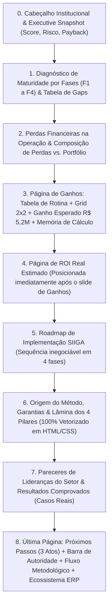

# PLANO DE IMPLEMENTAÇÃO: REFORMULAÇÃO EXECUTIVA & SMART DIAGNOSTIC — SIIGA ASSESSMENT

> **Documento de Especificação Técnica e Comercial**  
> **Objetivo:** Elevar o SIIGA Assessment ao padrão de consultoria estratégica de classe mundial (McKinsey / Falconi / PwC), eliminando vazios de diagramação no PDF, otimizando o fluxo de dados e implementando uma abordagem bi-focal (C-Level + Liderança Técnica de Engenharia).

---

## 📑 1. NOVO SEQUENCIAMENTO EXECUTIVO DO RELATÓRIO

O relatório final gerado para a diretoria e equipe técnica seguirá rigorosamente a ordem lógica de valor:

---

## 🎨 2. DIRETRIZES DE DESIGN SYSTEM (Executive Charcoal & Copper)

| Elemento | Padrão Anterior | Novo Padrão Executivo |
| :--- | :--- | :--- |
| **Fundo Base** | `#0b0c10` (Preto chapado) | **`#0f1015` (Deep Executive Charcoal)** |
| **Cards & Superfícies** | `#14161f` com bordas espessas | **`#151720` com hairline border `1px solid rgba(255,255,255,0.06)`** |
| **Acentos de Destaque** | Laranja fluorescente `#ff5f1f` | **Cobre Fosco / Âmbar Profundo (`#ea580c`)** |
| **Cor de Benchmark** | Verde claro `#34d399` | **Verde Esmeralda Institucional (`#10b981`)** |
| **Tipografia & Textos** | Cores cinzas genéricas | **Títulos: `#ffffff`, Corpo: `#cbd5e1`, Metadados: `#94a3b8`** |
| **Elementos Gráficos** | Emojis (`💬`, `🎯`, `🔌`, `▲`) e avatares | **Numeração editorial (`01`, `02`...), aspas `“...”` e tags corporativas** |
| **Numerais Financeiros** | Fontes convencionais | **`font-variant-numeric: tabular-nums` (alinhamento monetário)** |

> **Escopo:** este design system vale para o **PDF exportado** (`generatePDF` / `applyPdfDarkTheme`). As telas interativas do app (formulário, fases, radar) não são alteradas por esta rodada — são dois contextos visuais distintos e intencionalmente diferentes.

---

## 📐 3. DETALHAMENTO DAS MUDANÇAS DE LAYOUT E DIAGRAMAÇÃO

### 3.1. Página de Ganhos (Página 4)
* **Problema Resolvido:** Eliminação do grande espaço vazio na metade inferior da página.
* **Composição da Página:**
  1. **Transformação da Rotina Operacional:** Tabela comparativa (Antes x Com SIIGA).
  2. **Smart Grid 2x2 de Ganhos Qualitativos:** Cards editoriais numerados `01`, `02`, `03`, `04`.
  3. **Ganho Esperado com o SIIGA (Realocado):** Card com os 2 números de impacto:
     - `R$ 5,2M` — Capturável no Portfólio de Obras.
     - `R$ X/mês` — Ganho Líquido Recorrente da Equipe Técnica.
  4. **Quadro de Memória de Cálculo Integrada (Novo):** Demonstrativo sintético logo abaixo dos números:
     - *Mitigação de Perdas de Obra:* Redução de estouro de orçamento + estancamento de retrabalho.
     - *Eficiência de Engenharia & Gestão:* Horas técnicas recuperadas em rotinas de planejamento, medição e integração com ERP.
* **Remoção:** Retirar desta página a barra de resultados (`+1.500 canteiros / 70M m²`) — transferida para a última página.

---

### 3.2. Página de ROI Real Estimado (Página 5)
* **Posicionamento:** Inserida **imediatamente após a Página de Ganhos**, criando a ponte direta: *Ganhos Qualitativos $\rightarrow$ Demonstração Financeira do Retorno*.
* **Composição da Página:**
  1. Header com Payback Estimado, ROI Mensal e Ganho Líquido.
  2. Demonstração por rotinas (Planejamento, Lookahead, Medição, Fechamento de Folha/Medição).
  3. Faixa de Retorno por Cenário (Pessimista, Conservador, Realista, Pleno).
  4. Pressupostos documentados da operação do cliente.

---

### 3.3. Vetorização da Lâmina dos 4 Pilares SIIGA
* **Problema Resolvido:** Eliminar a imagem estática raster `siiga-pilares.png` que perde resolução e destoa do Dark Mode.
* **Implementação:** Componente nativo HTML/CSS com 4 colunas verticais:
  - **Pilar 01 · Planejamento:** Last Planner, modelo de produção, ensaio de recursos, linha de base.
  - **Pilar 02 · Proteção:** Restrições, lookahead planning, comprometimento de MO, reprogramação tática.
  - **Pilar 03 · Gestão:** Plano semanal, ciclo diário, avanço físico, controle de produção MO.
  - **Pilar 04 · Controle:** Performance Hub, indicadores de qualidade, pagamento por evidência, reunião de inteligência.
  - **Barra de Métricas Institucionais (Rodapé do Bloco):** `+10.000 Obras Reais` | `+20 Anos de Campo` | `+10 Anos de Dados`.

---

### 3.4. Última Página: Autoridade, Próximos Passos & Ecossistema
* **Composição da Página:**
  1. **Apresentação da Solução Agilean em 3 Atos:** `01 Metodologia & Copilotos`, `02 Canteiro Ágil & Gestão`, `03 Fechamento Blindado & Performance Hub`.
  2. **Barra de Métricas e Autoridade (Reposicionada):** Fita escura elegante com:
     - `+1.500 Canteiros gerenciados` | `70M m² Construídos` | `2x mais Aderência de prazo` | `API Nativa Sienge, TOTVS, Informakon, Mega, UAU`.
  3. **Fluxo Metodológico de Gestão Integrada:** Grid `01` a `06` numerado.
  4. **Ecossistema & Integrações Nativas de ERP:** Logos em alta definição (MS Project, Excel, Sienge, TOTVS, Informakon, Mega, UAU).

---

### 3.5. Pendência Conhecida: Espaço Vazio Residual (Follow-up) — **[Concluído nesta rodada]**
O protótipo da rodada anterior resolveu o vazio da Página de Ganhos, mas 3 páginas ainda sobravam espaço em branco na parte inferior: a tabela de Gaps isolada, o Roadmap isolado, e a página institucional 2 (Pareceres de Lideranças). Causa: o algoritmo de paginação (`generatePDF`, bin-packing por `html2canvas`) nunca corta um card no meio — se o conteúdo de uma página não enche o card seguinte inteiro, sobra vazio.
* **Correção aplicada:** os 3 blocos (e os cards vizinhos que os deixavam "presos" sozinhos numa página — Perdas Financeiras e SIIGA · Origem do Método/4 Pilares) foram quebrados em sub-cards menores, mesmo padrão já aplicado à Página de Ganhos:
  - **Gaps:** Card A (título + resumo executivo com 3 estatísticas reaproveitadas da tabela/radar) + Card B (tabela).
  - **Perdas Financeiras:** Card C (cálculo principal) + Card D (pressupostos + composição visual) + Card E (fechamento).
  - **Roadmap:** Card (título + contexto) + Card (timeline).
  - **SIIGA — Origem do Método:** Card (Origem do Método + Garantias) + Card (Lâmina dos 4 Pilares + métricas institucionais).
  - **Página institucional 2 (Pareceres):** Card de título + 1 card por depoimento (3 cards).
* **Resultado:** o bin-packing greedy agora tem unidades menores para recombinar em cada página, eliminando as sobras de espaço em branco identificadas — validado via geração real do PDF (fluxo completo do app, sem inserção de registros de teste no Supabase).

---

## ⚡ 4. SMART DIAGNOSTIC — CONCISO NA EXPERIÊNCIA, SEM PERDER PRECISÃO NO SCORE

### 4.1. Diagnóstico das Redundâncias Atuais
O modelo atual possui ~28 perguntas e 11 campos numéricos de horas. Isso gera cansaço em reuniões comerciais.

### 4.2. Princípio de Redesenho: Fundir o Momento de Pergunta, Nunca o Dado por Trás Dele
A versão anterior deste plano propunha fundir perguntas que hoje alimentam **scores de pilares diferentes** no radar (F3.4 pontua "Gestão da Produção", MO.6 pontua "Mão de Obra", F4.4 pontua "Controle"). Colapsar isso em uma única pergunta → um único score destrói exatamente o que torna o diagnóstico sério e cirúrgico: a capacidade de mostrar "forte em Planejamento, fraco em Controle" em vez de uma nota genérica. Além disso, hoje não há volume de dados histórico suficiente (poucos diagnósticos salvos até o momento) para provar que essas 3 respostas sempre andam juntas — assumir isso sem validar é arriscado.

**Regra de ouro adotada a partir daqui:** o cliente pode responder **menos telas/momentos** de pergunta — a experiência de preenchimento fica mais curta e mais parecida com uma conversa — mas cada dimensão do radar (Planejamento, Proteção, Gestão, Controle) continua recebendo seu **próprio dado**, capturado de forma independente. Nunca duplicar ou inferir o score de um pilar a partir da resposta de outro.

### 4.3. Fusões Recomendadas (Redução de Telas, Não de Dimensões de Score)

1. **Trava de Qualidade (F3.4 + MO.6 + F4.4) — 1 momento de pergunta, 3 confirmações independentes:**
   - *Pergunta-guia (framing único, uma só tela):* *"A aprovação da FVS técnica no canteiro é uma trava eletrônica obrigatória para a medição física e a liberação de pagamento no ERP — ou ainda é possível pagar serviços sem inspeção concluída?"*
   - *Sub-confirmações rápidas na mesma tela* (toggle ou seleção curta, sem parecer 3 perguntas novas): "Isso vale para: Execução (F3) · Mão de Obra (MO) · Controle (F4)?" — cada resposta alimenta o score do pilar correspondente exatamente como hoje.
2. **Rito de Reprogramação (F2.3 + F4.1) — mesmo princípio:**
   - *Pergunta-guia:* *"Ao final de cada ciclo de obra, existe uma rotina formal de reprogramação que analisa desvios de causa raiz e gera novo plano aprovado pela gestão?"*
   - *Sub-confirmações:* Proteção (F2) e Controle (F4), cada uma com seu próprio score.
3. **Consolidação dos 11 Campos de ROI em 4 Telas de Driver (dado real preservado):**
   - **Driver 1:** *Dias de Fechamento de Mês* (Ex: 4 dias/mês).
   - **Driver 2:** *Horas Semanais de Gestão/Planilhas* (Ex: 8h/semana).
   - **Driver 3:** *Folha Mensal de MO / Orçamento Médio de Empreiteiros*.
   - **Driver 4:** *Frequência de Apontamento de Canteiro* (Diária / Semanal / Mensal).
   - *O que muda:* os 11 campos atuais são reagrupados em **4 telas compactas** (2-3 campos correlatos por tela, em vez de um campo por tela) — reduz a sensação de formulário longo. O que **não muda**: os números continuam sendo os dados reais informados pelo próprio cliente. Coeficientes estatísticos podem no máximo sugerir um valor-placeholder editável (ex.: "a média do seu porte é X — ajuste se souber o real"), nunca substituir silenciosamente o dado do cliente por uma estimativa. Isso preserva o argumento comercial mais forte do relatório: "esses números são seus, não um chute do sistema".

### 4.4. Pré-requisito Antes de Codar
Mapear, para cada fusão, uma planilha de-para explícita: pergunta original → pilar/score que alimenta → como a nova tela captura esse mesmo dado. Validar esse mapeamento antes da implementação, não depois — é a parte que mais facilmente introduz regressão silenciosa no radar.

### 4.5. Compatibilidade com Diagnósticos Já Salvos
Reduzir/reagrupar perguntas muda o formato dos dados salvos (`S.scores`, `state` no Supabase). Diagnósticos feitos antes desta mudança precisam continuar exibindo corretamente no admin e em comparações "antes x depois" (já existe um caso de uso real disso — ver PDFs `TESTE_ANTES`/`TESTE_DEPOIS`). Definir uma estratégia simples de versionamento do formato de diagnóstico antes do rollout, para não repetir os remendos de compatibilidade que já existem hoje em `admin.js` (filtro de nível com nomenclatura antiga).

---

## 🎯 5. MATRIZ DE NARRATIVA BI-FOCAL (DIRETORIA vs. ENGENHARIA)

| Ponto de Contato | Argumento para a Diretoria (CEO/CFO) | Argumento para o Nível Técnico (Gerente/Engenheiro) |
| :--- | :--- | :--- |
| **Diagnóstico de Gaps** | "Exposição de R$ 5,2M em risco no portfólio." | "Mapeamento dos gargalos que sobrecarregam sua equipe no dia a dia." |
| **Ganhos e Rotina** | "Previsibilidade de entrega e blindagem de margem." | "Eliminação de planilhas manuais e reuniões de estresse no fim do mês." |
| **Trava de FVS** | "Nenhum centavo liberado sem lastro físico." | "Blindagem técnica do CPF do engenheiro contra cobranças indevidas." |
| **Escalabilidade** | "Capacidade de crescer sem inflar custos fixos." | "Tocar o dobro de obras de forma enxuta e sem burnout da equipe." |
| **Roadmap / Próximos Passos** | "Sequência de implementação com retorno comprovado em cada fase — risco de execução controlado." | "Plano passo a passo sem pico de carga sobre a equipe atual, com marcos claros de entrega." |

> **Nota de posicionamento:** a conversão acontece na conversa ao vivo com o consultor — o PDF é o resumo pós-reunião, não uma peça de venda fria. Por isso a linha "Roadmap" acima é a que mais importa: é onde o cliente precisa sentir que saiu com um **plano de ação**, não só um diagnóstico de problemas (essa é a definição de "recompensa" validada com o usuário). As demais linhas da tabela reforçam a decisão já tomada na reunião; não precisam carregar um CTA agressivo.

---

## 🛠️ 6. MAPEAMENTO DE ARQUIVOS DE CÓDIGO

* **`siiga-assessment/index.html`**:
  - Reestruturação das tags dentro de `#screen-report`.
  - Remoção da tag `` dos 4 pilares e inclusão da estrutura HTML/CSS nativa.
  - Reposicionamento do card de Ganho Esperado e da Barra de Resultados.
* **`siiga-assessment/script.js`**:
  - `buildReport()`: Orquestração na nova sequência de renderização.
  - `renderQualitativeGains()`: Renderização do Grid 2x2 + Ganho Esperado + Memória de Cálculo na Página 4.
  - `renderRotinaComparativa()` & `renderPerdasComposicao()`: Formatação tabular de auditoria.
  - `applyPdfDarkTheme()` & `generatePDF()`: Agrupamento em bin-packing sem cortes nas páginas 4, 5 e última página. **[Concluído nesta rodada]**
  - `confirmSave()`: corrigido para só exibir "salvo com sucesso" quando o insert no Supabase realmente funcionar (antes mentia em caso de falha silenciosa). **[Concluído nesta rodada]**
* **`siiga-assessment/admin.js`** *(necessário quando a Seção 4 — Smart Diagnostic — for implementada)*:
  - Ajustar filtros de nível/score para tolerar diagnósticos salvos no formato antigo (28 perguntas) convivendo com o novo formato reduzido — mesmo padrão de compatibilidade que já existe hoje para a nomenclatura de nível antiga.

---

## ✅ 7. CHECKLIST DE ACEITE DA IMPLEMENTAÇÃO

> **Correção:** o pipeline de geração de PDF em produção é **client-side, jsPDF + html2canvas** (roda no navegador do consultor). Puppeteer não faz parte da produção — existe apenas como script solto de prototipagem local (`scratch/generate_dark_pdf.js`), não deve ser confundido com o pipeline real nem tratado como meta de migração.

**Rodada 1 (Reformulação Executiva — Seções 1-3):**
- [x] Página 4 (Ganhos) preenchida sem espaços vazios, contendo Tabela de Rotina + Grid 2x2 + Ganhos R$ 5,2M + Memória de cálculo.
- [x] Página de ROI posicionada imediatamente após a Página de Ganhos.
- [x] Lâmina dos 4 Pilares SIIGA 100% vetorizada em HTML/CSS (sem artefatos ou fundo branco no Dark Mode).
- [x] Barra de autoridade (`+1.500 canteiros...`) posicionada na última página acima dos ERPs.
- [x] Header com *Executive Snapshot* sintetizando Score, Risco e Payback.
- [x] `confirmSave()` não relata sucesso quando o Supabase falha (fix de confiabilidade do admin).
- [x] Espaço vazio residual eliminado nas páginas de Gaps, Roadmap e página 2 (ver 3.5 — concluído).
- [x] PDF exportado (jsPDF/html2canvas) sem quebras órfãs de página ou sobreposições nessas 3 páginas específicas.

**Rodada 2 (Smart Diagnostic — Seção 4, concluída):**
- [x] Planilha de-para pergunta → pilar/score validada antes da implementação (ver 4.4) — as 5 perguntas fundidas (F2.3, F3.4, MO.6, F4.1, F4.4) mantiveram seus `code` e escala de score originais (0/1/1.5/3); score gravado/lido por `code` via novas `setScoreByCode()`/`getScoreByCode()` em vez de por posição de array, para permitir que uma combo-tela de uma fase grave o score de uma pergunta de outra fase sem quebrar a indexação posicional usada pelo restante do relatório (gaps, oportunidades, radar).
- [x] Fusões de tela implementadas sem reduzir o número de dimensões de score do radar (F1-F4/MO continuam independentes) — combo "Trava de Qualidade" (F3.4 + MO.6 + F4.4, disparada na posição de F3.4/Fase 3) e combo "Rito de Reprogramação" (F2.3 + F4.1, disparada na posição de F2.3/Fase 2), cada sub-item com suas 4 opções originais e score próprio no pilar de origem. Implementado apenas no fluxo principal (`renderPhaseQ`/`getNavQs`); o Diagnóstico Focado (`renderFocusedQ`) não usa fusões, mantendo pergunta a pergunta.
- [x] Telas de ROI reagrupadas: MO.ROI1 + F4.ROI fundidas em uma única tela "Financeiro & Visão Executiva" (2 campos: folha + fluxoCruzar) quando o bloco MO existe no fluxo — 5 telas de ROI → 4 (F1.ROI, F2.ROI e F3.ROI não foram tocadas, por já terem tamanho adequado). Dado real informado pelo cliente preservado nas mesmas chaves de `S.roi2`, sem substituição por estimativa.
- [ ] Estratégia de compatibilidade para diagnósticos salvos no formato antigo definida e testada no admin (ver 4.5) — não avaliado nesta rodada; os `code` originais foram preservados, o que preserva compatibilidade de leitura por código, mas a estratégia de tolerância do admin.js em si não foi revisada.
- [x] PDF de validação gerado via fluxo completo automatizado (Playwright) com scores variados nas 2 combo-telas (níveis 0, 1, 1,5 e 3), clicando "Cancelar" no modal de salvamento (sem gravar no Supabase); as 8 páginas renderizadas via pymupdf confirmaram que os 4 gaps críticos/oportunidade das combo-telas apareceram no pilar correto (F3.4→Fase 3, MO.6→MO, F4.4→Fase 4, F4.1→Fase 4) e que F2.3 (score 3, não-gap) corretamente não apareceu na lista de gaps.

**Rodada 3 (Narrativa Bi-Focal — Seção 5, concluída):**
- [x] Textos da matriz bi-focal aplicados nas 5 seções correspondentes do relatório (Gaps, Ganhos, Trava de FVS, Escalabilidade e Roadmap).
- [x] Bug corrigido: caixa "Para a engenharia" do Roadmap renderizava vazia no PDF — causa raiz era o fundo opaco `#faf9f8` da caixa (não convertido pelo Dark Theme, ao contrário do fundo `rgba(255,95,31,0.06)` da caixa "Para a diretoria"), somado ao texto `#333` que a regra genérica de `applyPdfDarkTheme()` converte para branco — resultando em texto branco sobre fundo quase branco. Corrigido trocando o fundo para `rgba(136,136,136,0.06)` (translúcido, como o par "diretoria").
- [x] Bug corrigido: contraste baixo na chamada bi-focal da Trava de FVS (seção Ganhos) — o texto do card usava a cor literal `#7c5b3a`, fora da lista de cores que `applyPdfDarkTheme()` reconverte para claro no PDF escuro, ficando apagado sobre o fundo que a mesma função escurece. Corrigido trocando para `var(--gray2)` (mesmo padrão já usado nas chamadas de Gaps e Ganhos), com o rótulo "Sobre a trava de qualidade (FVS):" em `#333` para consistência com os demais rótulos.
- [x] PDF de validação gerado via fluxo completo automatizado (Playwright), com scores variados no diagnóstico, e as 11 páginas renderizadas e revisadas via pymupdf — as 5 chamadas bi-focais e as duas correções confirmadas visualmente no PDF final.
